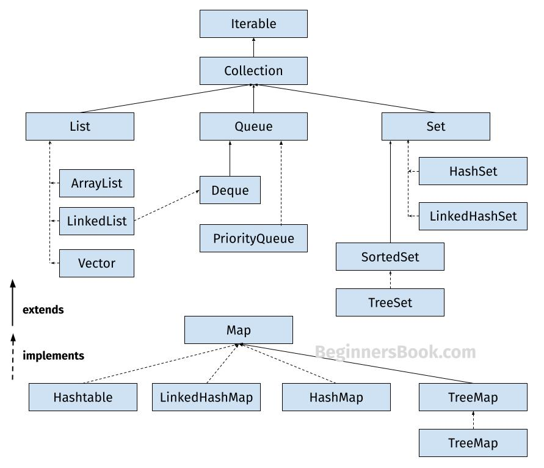

## Java Collection Framework

Java Collections are set of classes and interfaces, which helps the devlopers to store and process the dat effeciently. This frameworks have set of useful classes and tons of useful functions which helps the developers to simply build the logic.

### List

List is an interface which stores the elements in the sequential order, List may contain the duplicate elements, elements are inserted and fetched in the order they are inserted. Zero based indexing is used.

The classes that implements the List<> interface are:
1. ArrayList
2. LinkedList
3. Vector

#### ArrayList
- ArrayList can automatically / dynamically grow or shrink based on the elements insertions or deletions, while array (traditional) cannot.
- ArrayList accepts the duplicated including null.
- It maintains the insertion order
- ArrayList is non-synchronized, we can make it synchronized.

#### LinkedList
You must be aware of the arrays which is also a linear data structure but arrays have certain limitations such as:
1) Size of the array is fixed which is decided when we create an array so it is hard to predict the number of elements in advance, if the declared size fall short then we cannot increase the size of an array and if we declare a large size array and do not need to store that many elements then it is a waste of memory.

2) Array elements need contiguous memory locations to store their values.

3) Inserting an element in an array is performance wise expensive as we have to shift several elements to make a space for the new element. For example:
   Let’s say we have an array that has following elements: 10, 12, 15, 20, 4, 5, 100, now if we want to insert a new element 99 after the element that has value 12 then we have to shift all the elements after 12 to their right to make space for new element.

Similarly deleting an element from the array is also a performance wise expensive operation because all the elements after the deleted element have to be shifted left.

These limitations are handled in the Linked List by providing following features:
1. Linked list allows dynamic memory allocation, which means memory allocation is done at the run time by the compiler and we do not need to mention the size of the list during linked list declaration.

2. Linked list elements don’t need contiguous memory locations because elements are linked with each other using the reference part of the node that contains the address of the next node of the list.

3. Insert and delete operations in the Linked list are not performance wise expensive because adding and deleting an element from the linked list does’t require element shifting, only the pointer of the previous and the next node requires change.

#### Vector
Vector implements List Interface. Like ArrayList it also maintains insertion order but it is rarely used in non-thread environment as it is synchronized and due to which it gives poor performance in searching, adding, delete and update of its elements.

##### Points
1. Default capacity of the vector is 10, if we keep inserting after limit reached it doubles the size.

#### Commonly used methods of Vector Class:
- void addElement(Object element): It inserts the element at the end of the Vector. 
- int capacity(): This method returns the current capacity of the vector. 
- int size(): It returns the current size of the vector. 
- void setSize(int size): It changes the existing size with the specified size. 
- boolean contains(Object element): This method checks whether the specified element is present in the Vector. If the element is been found it returns true else false. 
- boolean containsAll(Collection c): It returns true if all the elements of collection c are present in the Vector. 
- Object elementAt(int index): It returns the element present at the specified location in Vector. 
- Object firstElement(): It is used for getting the first element of the vector. 
- Object lastElement(): Returns the last element of the array. Object get(int index): Returns the element at the specified index. 
- boolean isEmpty(): This method returns true if Vector doesn’t have any element. 
- boolean removeElement(Object element): Removes the specifed element from vector. 
- boolean removeAll(Collection c): It Removes all those elements from vector which are present in the Collection c. 
- void setElementAt(Object element, int index): It updates the element of specifed index with the given element.

### Set

The set is the collection , that holds the elements , duplicates are not allowed , a single null value is allowed.

#### HashSet

1. HashSet is the collection or class that stores the elements unique.
2. HashSet uses the HashTable data structure internally.
3. HashSet doesn't maintain any order.
4. HashSet allows null values, if we try to insert more it would override existed one.
5. HashSet is not synchronized.

#### Initial capacity and load factor
- Initial capacity says , the current capacity of the hashset to store the number of elements.
- Load factor measures the load of HashSet, it represents how much the HashSet is full. A load factor of .60 means that when HashSet is 60% full, the capacity of HashSet is automatically increased.

### HashMap

HashMap is a collection that is used to store the <key, value> pairs.

It is not an ordered collection because it donot return the keys and vlaues in which order they have inserted.

#### Keypoints
1. the key must be unique, stores the key-value pairs
2. it is non-synchronized 
3. it do not maintain the insertion order.
4. it allows null keys and values. however one null key is allowed. multiple null values are allowed.

